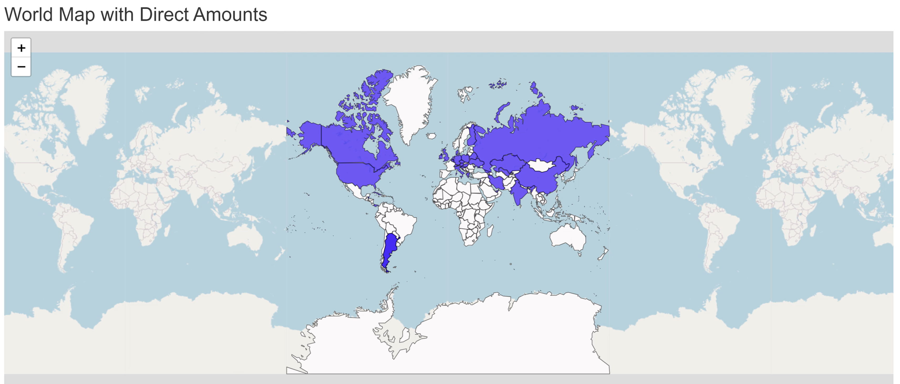
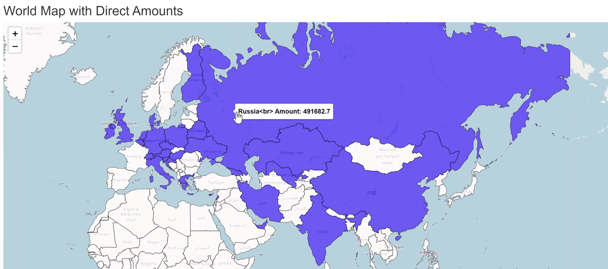
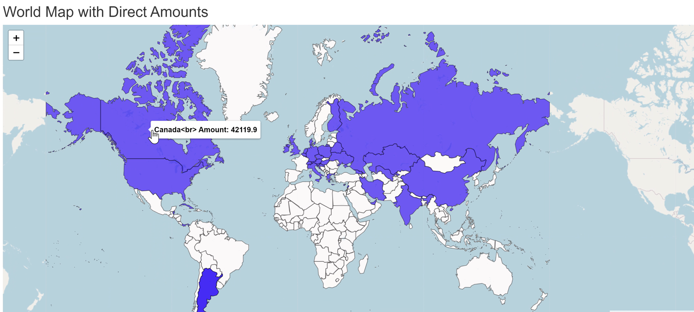

---
output:
  pdf_document:
    latex_engine: xelatex
geometry: margin=1in
---
```{r setup, include = FALSE}
knitr::opts_chunk$set(echo = FALSE, warning = FALSE, message = FALSE, error = FALSE)

```
\begin{titlepage}
\centering
\vspace*{2cm}

{\Large\textbf{Data Visualization}}\\
\vspace{0.5cm}
{\large\textbf{DS116 / CS343}}\\
\vspace{2cm}

\textbf{\large Final Project}\\
\vspace{1cm}
{\LARGE Foreign Investments and Taxpayer Institutions Growth Relationship in Armenia}\\
\vspace{2cm}

\textbf{\large Anna Mikayelyan}\\
\textbf{\large Ruben Toroyan}\\
\textbf{\large Davit Sargsyan}\\
\textbf{\large Armen Ghazaryan}\\

\vfill
{\large American University of Armenia}\\
{\large Yerevan, Armenia}\\
{\large December 06, 2024}\\
\end{titlepage}

\newpage

# Abstract

In the scope of this project, we explore the relationship between foreign direct investments in Armenia and the possible growth of new taxpayer institutions in the country. We analyze the data about Armenian taxpayer institutions, their classification and trends of foreign direct investments to understand if there is a possible influence of FDI on the country’s business activity. The suggested hypothesis is the following: **“There is a positive correlation between foreign investments in an economic sector and the development of that sector. (Measured by the number of new companies created annually in Armenia)”**
In the next chapters different visualizations and data visualization techniques will be showcased to identify patterns supporting our hypothesis. The final findings have the potential to help policymakers and investors to better understand the trends and be aware of the role of FDI in promoting economic growth and enterpreneurship.  

# Keywords

Foreign Investments, FDI, Taxpayer Institutions, Economic Growth, Armenia, Entrepreneurship, Data Visualization

\newpage

# Introduction

Foreign direct investment (FDI) has long been viewed as a crucial driver of economic growth, particularly for developing countries. It serves as a catalyst for fostering innovation, enhancing productivity, and encouraging entrepreneurship by injecting much-needed capital and expertise into various economic sectors. In Armenia, a country characterized by a dynamic economic landscape, understanding the influence of foreign investments on local business activities is essential for policymakers, investors, and researchers alike.
This report delves into the relationship between foreign direct investments and the growth of new taxpayer institutions in Armenia. By analyzing data on Armenian taxpayer institutions, their classifications, and trends in foreign direct investments, we aim to determine whether FDI positively correlates with the emergence of new businesses. The hypothesis guiding this study suggests that an increase in foreign investments within an economic sector contributes significantly to the development of that sector, as indicated by the number of newly established companies.
Through a combination of statistical analysis and visualization techniques, we aim to uncover the patterns that illustrate the role of FDI in stimulating economic growth and entrepreneurship in Armenia. The findings are intended to provide valuable insights for both economic strategists and stakeholders interested in the country's developmental trajectory.

\newpage

# Literature Review

The connection between foreign direct investment (FDI) and the development of economic sectors, particularly measured by the number of new companies established, has been explored in several studies relevant to Armenia and similar countries.

Javorcik (2004) looked into whether FDI enhances productivity in domestic firms within the same industry in Lithuania. Her study found that FDI leads to positive productivity spillovers, especially when there are strong backward linkages with local suppliers. Although she didn't directly measure new company creation, the boost in productivity and competitiveness might encourage entrepreneurship and lead to the establishment of new firms in the sector.

Meyer and Sinani (2009) conducted a meta-analysis of 66 studies to find out when FDI generates positive spillovers. They concluded that countries with medium levels of economic development—like Armenia—are more likely to benefit. Sectors with high competition and innovation tend to gain the most. Even though their focus wasn't specifically on new companies, the improved technology and business practices from FDI can lower barriers to entry and stimulate entrepreneurship.

Scholer-Iordanashvili (2021) examined the impact of FDI on economic growth in the South Caucasus, focusing on Georgia. The study found a significant positive effect of FDI on economic growth, particularly in key sectors like manufacturing and services. Increased FDI in these areas can create favorable conditions for new company formation due to better infrastructure and more market opportunities.

In Armenia, Hakhinyan (2013) analyzed FDI with an emphasis on institutional quality and how FDI is spread across different sectors. The research showed that FDI in industrial and energy sectors significantly boosts economic growth. However, challenges like bureaucratic hurdles and lack of transparency can hinder new company creation. Improving institutional frameworks could enhance the positive effects of FDI on sector development and entrepreneurship.

In summary, these studies support the idea that foreign investments in an economic sector positively correlate with the development of that sector. While not all of them directly measure new company creation, the increased productivity, economic growth, and better environment for entrepreneurship associated with FDI suggest that there's a good chance for more new companies to emerge in Armenia.


\newpage

# Data Overview and Methodology

The data used in this study come from three distinct datasets, each contributing vital information to the analysis of the relationship between foreign direct investments (FDI) and the growth of new taxpayer institutions in Armenia. The first dataset, the Taxpayer Classification Dataset, provides a categorization of activities in Armenia. It includes two key columns: one representing a code unique to each activity type and another describing the activity in detail. This dataset required minimal processing as it was already well-structured and directly applicable to the study.

For this dataset, we also applied a regex operation on the “Type of Activity” column to extract and process the primary category of each activity code. This code, which is divided into three parts, was used to identify the main category of each activity. The extracted main category was later utilized during the merging process with the investment dataset.

The second dataset is the Foreign Investments Dataset (source: Armstat), which contains detailed records of foreign investment flows into Armenia, categorized by activity type and year. This dataset initially included a wide range of information. However, only the columns essential to the analysis were retained, including the year of investment, the type of investment (total or direct), the type of activity receiving investments, and the investment numbers. The data was modified manually to focus solely on these aspects, ensuring relevance and clarity for the study.

The third dataset, “All Armenian Taxpayers Until Today,” (source: not revealed) is a comprehensive compilation of records on registered taxpayers in Armenia. It includes columns such as taxpayer ID, name, organizational-legal type, legal address, type of activity, registration date, status, tax regime, and the date of registration in the tax regime. Given its complexity, this dataset was processed and cleaned using a Python script. The cleaning involved standardizing column names and formats, removing unnecessary columns, and filtering the data to include only active taxpayers with valid registration dates and business activities. This process ensured that the data was accurate, consistent, and aligned with the objectives of the analysis.

To provide more comprehensive insights rather than just numerical data, we performed a left join between the main dataset and the fields containing activity descriptions. This allowed us to include precise descriptions for each taxpayer, ensuring that the data presented was not only numeric but also contextually rich with Armenian-language descriptions.
Together, these datasets were refined and harmonized to provide a coherent foundation for the study. The preprocessing steps ensured that the data was streamlined, relevant, and ready for the visualization and analysis necessary to explore the interplay between FDI and the growth of new taxpayer institutions in Armenia.

The analysis explores key datasets, including information on Armenian taxpayer institutions, their classifications, and trends in foreign investments over time. Various statistical methods and data visualization techniques, such as regression analysis and time series plots, were applied to identify patterns and correlations between FDI and the development of new businesses in the country. These techniques were chosen to ensure that the findings are reliable, clear, and easy to interpret, providing insights into how foreign investments potentially stimulate economic growth and entrepreneurship in Armenia.

\newpage

# Results and Discussion

Our analysis began by examining two primary datasets: 

**Visualizing the Taxpayer Dataset**

The first visualization, "Number of Taxpayers per Sector Code," showcases the distribution of companies across various economic sectors. The plot indicates significant variability, with some sectors demonstrating a much higher count of registered companies compared to others. The top five sectors by the number of companies are:

47 - Retail trade, except motor vehicles and motorcycles

96 - Other personal service activities

46 - Wholesale trade, except motor vehicles and motorcycles

62 - Computer programming, consultancy, and related activities

45 - Wholesale and retail trade and repair of motor vehicles and motorcycles

These sectors represent a mix of traditional commerce, personal services, and modern IT services, reflecting a diverse business environment in Armenia.


```{r, echo=FALSE, error=FALSE}
suppressPackageStartupMessages(library(dplyr))
suppressPackageStartupMessages(library(tidyverse))
suppressPackageStartupMessages(library(ggplot2))


taxpayers_prep_data <- read.csv("taxpayers_prep_data.csv", fileEncoding = "UTF-8")
investments_prep_data <- read.csv("investments_prep_data.csv", header = TRUE)

taxpayers_prep_data$sector_code <- as.factor(taxpayers_prep_data$sector_code)

sector_counts <- table(taxpayers_prep_data$sector_code)

sector_counts_df <- as.data.frame(sector_counts)
names(sector_counts_df) <- c("sector_code", "count")

sector_counts_df <- sector_counts_df %>%
  mutate(sector_code = reorder(sector_code, count))

ggplot(sector_counts_df, aes(x=sector_code, y=count, fill=sector_code)) +
  geom_bar(stat="identity") +
  coord_flip() +  
  theme_minimal() +
  labs(title="Number of Taxpayers per Sector Code",
       x="Sector Code",
       y="Number of Taxpayers",
       fill="Sector Code")

```


**Visualizing the Investment Dataset**

The second visualization, "Total Direct Investments per Sector," highlights the allocation of foreign direct investments (FDI) across different sectors. Unlike the taxpayer dataset, which is dominated by sectors with high counts of companies, the investment dataset underscores the sectors that receive the highest capital inflow. The top five sectors by the amount of investment are:

35 - Electricity, gas, steam, and conditioning supply

7 - Mining of metal ores

9 - Mining support service activities

61 - Telecommunications

24 - Manufacture of basic metals

These sectors primarily belong to capital-intensive industries, which align with the nature of FDI focusing on high-impact, resource-based, or infrastructure-oriented activities.


```{r, echo=FALSE, error=FALSE}
investments_agg <- investments_prep_data %>%
  select(code, ends_with("direct")) %>%  # Select columns with 'code' and those that end with 'direct'
  gather(key = "year", value = "direct_investment", -code) %>%  # Convert to long format
  group_by(code) %>%
  summarise(total_direct_investment = sum(direct_investment, na.rm = TRUE))  # Sum direct investments, ignoring NAs

# Reorder code based on total_direct_investment for ascending order
investments_agg <- investments_agg %>%
  mutate(code = reorder(code, total_direct_investment))

# Plotting the total direct investments per sector code horizontally and sorted
ggplot(investments_agg, aes(x=code, y=total_direct_investment, fill=code)) +
  geom_bar(stat="identity") +
  coord_flip() +  # Flip the coordinates to make the bars horizontal
  theme_minimal() +
  labs(title="Total Direct Investments per Sector",
       x="Sector Code",
       y="Total Direct Investment",
       fill="Sector Code")
```


From the visualizations, we observe a clear distinction between sectors with the highest number of companies and those receiving the largest share of investments. For instance, sectors like retail trade (47) and personal services (96) have high company counts but receive comparatively lower investments. Conversely, sectors such as electricity and gas supply (35) and mining (7, 9) have fewer companies but attract significant FDI due to their strategic importance and high capital requirements.

  As part of this project, an RShiny application was developed to create an interactive world map, which allows users to explore and visualize the foreign direct investments (FDI) flowing into Armenia from various countries over time. The primary objective of the app is to provide a dynamic and engaging way to display the volume of investments from different countries, updating annually to reflect the most recent data.

| {width=80%} |
|------------------------------------------|
| {width=80%} |
|------------------------------------------|
| {width=80%} |


\newpage

Afterwards, we considered the "Number of Registered Taxpayers Over Time" and "Total Investments Over Time"


```{r, echo=FALSE, error=FALSE}
taxpayer_counts <- taxpayers_prep_data %>%
  filter(registration_year >= 2014 & registration_year <= 2024) %>%
  group_by(registration_year) %>%
  summarise(count = n())  

ggplot(taxpayer_counts, aes(x = registration_year, y = count)) +
  geom_line(color = "skyblue", size = 1) +
  geom_point(color = "darkblue", size = 2) +
  theme_minimal() +
  labs(title = "Number of Registered Taxpayers Over Time",
       x = "Year",
       y = "Count")
```
The first plot illustrates a steady increase in the number of registered taxpayers in Armenia over the years, with a significant upward trend observed after 2019. The sharp rise between 2020 and 2023 indicates a notable acceleration in company registrations, suggesting a dynamic economic environment during this period.


```{r, echo=FALSE, error=FALSE}
investment_over_time <- investments_prep_data %>%
  select(ends_with("direct")) %>%
  summarise(across(everything(), sum, na.rm = TRUE)) %>%
  pivot_longer(cols = everything(), names_to = "year", values_to = "investment") %>%
  mutate(year = as.numeric(gsub("X|_direct", "", year))) %>%
  filter(year >= 2014 & year <= 2024)


ggplot(investment_over_time, aes(x = year, y = investment)) +
  geom_line(color = "skyblue", size = 1) +
  geom_point(color = "darkblue", size = 2) +
  theme_minimal() +
  labs(title = "Total Investments Over Time",
       x = "Year",
       y = "Investment (in Thousands)") +
  scale_y_continuous(labels = scales::comma)

```
And the second plot depicts the trends in foreign direct investments (FDI) in Armenia. While investments fluctuated between 2014 and 2019, they exhibit a consistent and significant increase from 2020 onward, peaking in 2023. This suggests heightened investor interest in Armenia during this time.

Based on these plots alone, we cannot definitively determine whether such a correlation exists.
Both plots represent aggregate trends without sector-level granularity. This makes it unclear whether the observed increase in company registrations is directly linked to specific sectors receiving higher FDI. Different sectors may respond differently to foreign investments, hence, we proceed with the separate sector and investment analysis.

```{r fig.width=14, fig.height=3, echo=FALSE, error=FALSE}
# Load the necessary libraries
suppressPackageStartupMessages(library(readr))
suppressPackageStartupMessages(library(tidyr))

investments_prep_data <- read_csv("cleaned_eng_investments.csv")

filtered_data <- investments_prep_data %>%
  filter(code %in% c('35', '7', '9', '61', '24'))

yearly_data <- filtered_data %>%
  select(code, '2014_direct', '2015_direct', '2016_direct', '2017_direct',
         '2018_direct', '2019_direct', '2020_direct', '2021_direct',
         '2022_direct', '2023_direct') %>%
  pivot_longer(cols = -code, names_to = "year_and_type", values_to = "investment") %>%
  separate(year_and_type, into = c("year", "investment_type"), sep = "_") #%>%
 # mutate(year = sub("X", "", year))  # Remove 'X' to clean the year column

yearly_data$investment <- as.numeric(yearly_data$investment)

yearly_data <- yearly_data %>%
  group_by(code, year) %>%
  summarise(investment = sum(investment, na.rm = TRUE), .groups = "drop")

ggplot(yearly_data, aes(x = year, y = investment, group = code, color = code)) +
  geom_line() +
  geom_point() +
  theme_minimal() +
  labs(title = "Yearly Direct Investments from 2014 for Selected Sectors",
       x = "Year",
       y = "Investment (Millions)",
       color = "Sector Code") +
  scale_x_discrete(limits = sort(unique(yearly_data$year))) +
  theme(axis.text.x = element_text(angle = 35, hjust = 1), legend.position = "none") +
  facet_wrap(~ code, nrow = 1, scales = "free_y")  # Arrange facets in a single row
```

This plot illustrates yearly direct investment trends for five selected sectors in Armenia (2014–2023). Mining of metal ores (Sector 7) shows steady growth post-2020, peaking in 2022, while mining support services (Sector 9) sees fluctuating investments with a recovery after 2021. Basic metals (Sector 24) and electricity supply (Sector 35) exhibit significant volatility, with major peaks in earlier years followed by declines. Telecommunications (Sector 61) experiences sharp peaks in 2015 and post-2020 recovery. The data highlights sectoral variability, with mining showing strong growth and others relying on cyclical or project-based investments, especially post-2020 economic recovery efforts.


```{r fig.width=14, fig.height=3, echo=FALSE, error=FALSE}
# Load the necessary libraries
library(readr)
library(dplyr)
library(ggplot2)

taxpayers_prep_data <- read.csv("taxpayers_prep_data.csv", fileEncoding = "UTF-8")

filtered_companies <- taxpayers_prep_data %>%
  filter(sector_code %in% c('35', '7', '9', '61', '24') & registration_year >= 2014 & registration_year <= 2023)

yearly_companies <- filtered_companies %>%
  group_by(sector_code, registration_year) %>%
  summarise(num_companies = n(), .groups = "drop")

ggplot(yearly_companies, aes(x = registration_year, y = num_companies, group = sector_code, color = sector_code)) +
  geom_line() +
  geom_point() +
  theme_minimal() +
  labs(title = "Yearly Company Creation from 2014 for Selected Sectors",
       x = "Year",
       y = "Number of Companies Created",
       color = "Sector Code") +
  scale_x_continuous(breaks = seq(2014, max(yearly_companies$registration_year, na.rm = TRUE), 1)) +
  theme(axis.text.x = element_text(angle = 35, hjust = 1), legend.position = "none") + # Yearly ticks
  facet_wrap(~ sector_code, nrow = 1, scales = "free_y")  # Arrange facets in a single row
```


Next, you can see yearly company creation trends for selected sectors in Armenia (2014–2023). Mining of metal ores (Sector 7) demonstrates steady growth, peaking in 2022, while mining support services (Sector 9) follow a similar pattern, with a sharp increase after 2020. Basic metals (Sector 24) show fluctuating company creation, with peaks aligning with earlier investment trends. Electricity supply (Sector 35) and telecommunications (Sector 61) display notable variability, with peaks in 2015 and post-2020 growth. The data reveals a mix of sector-specific dynamics, with mining and telecommunications showing dependency on investment-driven growth, while others exhibit less consistent patterns.

```{r fig.width=14, fig.height=3, echo=FALSE, error=FALSE}

investments_prep_data <- read_csv("cleaned_eng_investments.csv")

filtered_data <- investments_prep_data %>%
  filter(code %in% c('47', '96', '46', '62', '45'))

yearly_data <- filtered_data %>%
  select(code, '2014_direct', '2015_direct', '2016_direct', '2017_direct',
         '2018_direct', '2019_direct', '2020_direct', '2021_direct',
         '2022_direct', '2023_direct') %>%
  pivot_longer(cols = -code, names_to = "year_and_type", values_to = "investment") %>%
  separate(year_and_type, into = c("year", "investment_type"), sep = "_") #%>%
 # mutate(year = sub("X", "", year))  # Remove 'X' to clean the year column

yearly_data$investment <- as.numeric(yearly_data$investment)

yearly_data <- yearly_data %>%
  group_by(code, year) %>%
  summarise(investment = sum(investment, na.rm = TRUE), .groups = "drop")

ggplot(yearly_data, aes(x = year, y = investment, group = code, color = code)) +
  geom_line() +
  geom_point() +
  theme_minimal() +
  labs(title = "Yearly Direct Investments from 2014 for Selected Sectors",
       x = "Year",
       y = "Investment (Millions)",
       color = "Sector Code") +
  scale_x_discrete(limits = sort(unique(yearly_data$year))) +
  theme(axis.text.x = element_text(angle = 35, hjust = 1), legend.position = "none") +
  facet_wrap(~ code, nrow = 1, scales = "free_y")  # Arrange facets in a single row
```
This plot illustrates yearly direct investment trends for five selected sectors in Armenia from 2014 to 2023. Wholesale and retail trade (Sector 45) shows a significant decline in investments after 2014, with minimal activity in subsequent years. Wholesale trade (Sector 46) exhibits steady growth, peaking in 2022, reflecting increasing investor interest. Retail trade (Sector 47) displays a sharp rise post-2020, indicating a resurgence in consumer markets. IT and consultancy (Sector 62) shows fluctuating investments, with a notable recovery post-2020. Personal services (Sector 96) experiences minimal investments until 2023, when a dramatic spike occurs, suggesting a newfound focus on this sector.

```{r fig.width=14, fig.height=3, echo=FALSE, error=FALSE}

taxpayers_prep_data <- read.csv("taxpayers_prep_data.csv", fileEncoding = "UTF-8")

filtered_companies <- taxpayers_prep_data %>%
  filter(sector_code %in% c('47', '96', '46', '62', '45') & registration_year >= 2014 & registration_year <= 2023)

yearly_companies <- filtered_companies %>%
  group_by(sector_code, registration_year) %>%
  summarise(num_companies = n(), .groups = "drop")

ggplot(yearly_companies, aes(x = registration_year, y = num_companies, group = sector_code, color = sector_code)) +
  geom_line() +
  geom_point() +
  theme_minimal() +
  labs(title = "Yearly Company Creation from 2014 for Selected Sectors",
       x = "Year",
       y = "Number of Companies Created",
       color = "Sector Code") +
  scale_x_continuous(breaks = seq(2014, max(yearly_companies$registration_year, na.rm = TRUE), 1)) +  # Yearly ticks
  theme(axis.text.x = element_text(angle = 35, hjust = 1), legend.position = "none") +
  facet_wrap(~ sector_code, nrow = 1, scales = "free_y")  # Arrange facets in a single row
```

And this final plot series depicts yearly company creation trends for five selected sectors in Armenia from 2014 to 2023. Wholesale and retail trade (Sector 45) shows consistent growth in company creation, despite minimal investments in recent years, indicating resilience driven by market factors. Wholesale trade (Sector 46) demonstrates steady growth, with a sharp rise in 2022, likely aligned with investment increases. Retail trade (Sector 47) exhibits substantial growth post-2020, reflecting a surge in consumer market activities. IT and consultancy (Sector 62) sees exponential growth after 2020, highlighting the sector’s dependence on rising investments. Personal services (Sector 96) show continuous growth, peaking dramatically in 2023, correlating with increased investments.

So, the analysis of the four visualizations reveals varying dependencies on investments across Armenia's economic sectors. Sectors like IT, retail trade, personal services, and mining exhibit strong correlations between direct investments and company creation, with notable growth post-2020. These sectors demonstrate reliance on capital inflows for expansion, reflecting targeted investments in high-growth areas.

Conversely, sectors like electricity and basic metals show inconsistent relationships, with volatile investments and irregular company creation trends. These sectors may rely on external factors such as infrastructure, policies, or global market dynamics. Notably, the motor vehicle trade sector shows steady company growth despite declining investments, indicating resilience and market-driven growth.

The post-2020 period marks a significant turning point, with many sectors experiencing a surge in both investments and company creation. This likely reflects economic recovery efforts, increased demand for consumer goods, and the rising importance of digital and personal services. The analysis highlights the diversity in sectoral dynamics, emphasizing the need for tailored investment strategies to balance support for capital-dependent industries and market-driven growth. This approach ensures sustainable economic development by addressing the specific needs and potential of each sector.


\newpage

# Conclusion

This project aimed to explore the relationship between foreign direct investments (FDI) and sectoral development in Armenia, as measured by the number of new companies created annually. Our hypothesis proposed a positive correlation between FDI inflows and company creation within economic sectors.

The findings show that for some sectors, such as IT, retail trade, personal services, and mining, there is a strong alignment between increased investments and the rise in new company registrations, particularly after 2020. This supports the hypothesis for these sectors, demonstrating that targeted capital investment is a key driver of section growth. However, other sectors, like electricity supply and basic metals, exhibit inconsistent or weak relationships between FDI and company creation, suggesting that these industries are influenced by external factors such as infrastructure development, market conditions, or regulatory frameworks.

Given these mixed results, we partially accept our hypothesis. While FDI significantly impacts some sectors, its influence is not universal across all industries. To optimize economic development, policymakers should tailor investment strategies to sector-specific needs, fostering growth in high-potential areas while addressing structural challenges in others.


\newpage

## References

1. Javorcik, B. S. (2004). Does Foreign Direct Investment Increase the Productivity of Domestic Firms? American Economic Review, 94(3), 605-627.
https://www.aeaweb.org/articles?id=10.1257/0002828041464605 

2. Meyer, K. E., & Sinani, E. (2009). When and Where Does Foreign Direct Investment Generate Positive Spillovers? Journal of International Business Studies, 40(7), 1075-1094.
https://link.springer.com/article/10.1057/jibs.2008.111 

3. Scholer-Iordanashvili, L. (2021). The Impact of Foreign Direct Investment on the Economic Growth of South Caucasus Countries. Journal of Economic Integration, 36(4), 627-658.
https://www.researchgate.net/publication/355828959_The_Impact_of_Foreign_Direct_Investment_on_the_Economic_Growth_of_South_Caucasus_Countries 

4. Hakhinyan, A. (2013). Foreign Direct Investments in Armenia: The Importance of Institutional Quality and Sectoral Distribution. Master's Thesis, American University of Armenia.
https://dspace.aua.am/xmlui/bitstream/handle/123456789/497/Armine_Hakhinyan.pdf?sequence=1&isAllowed=y
